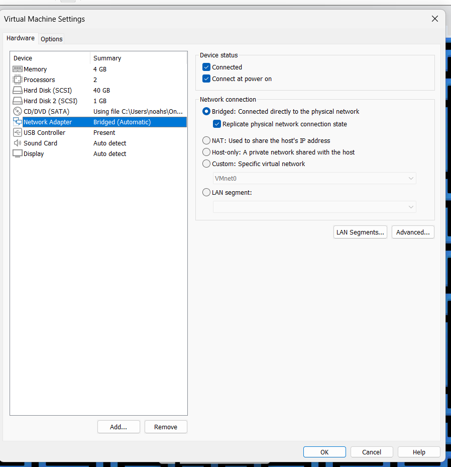
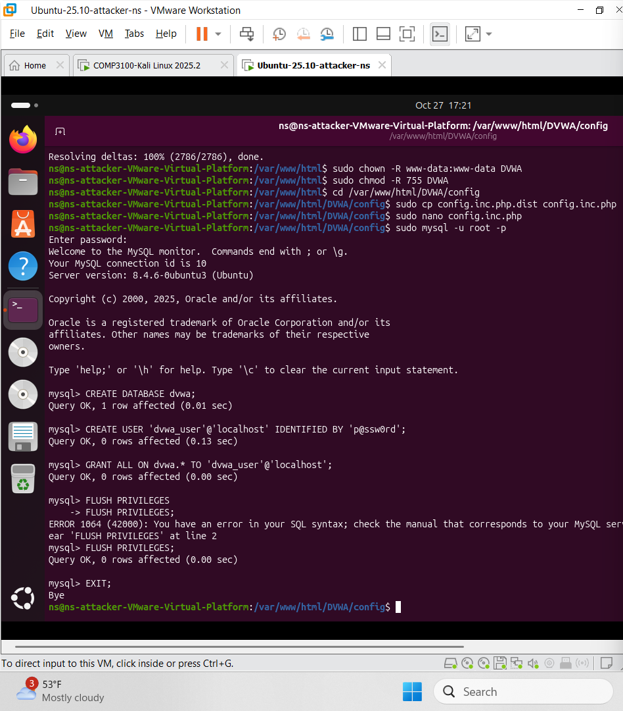
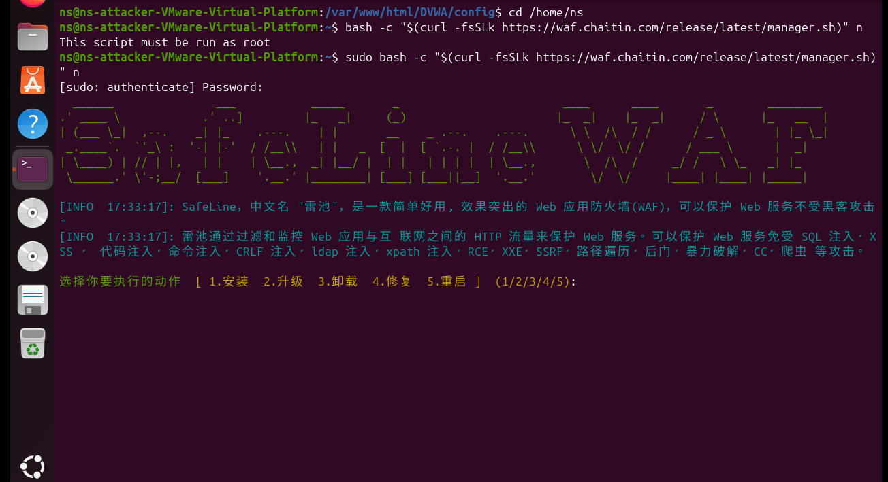
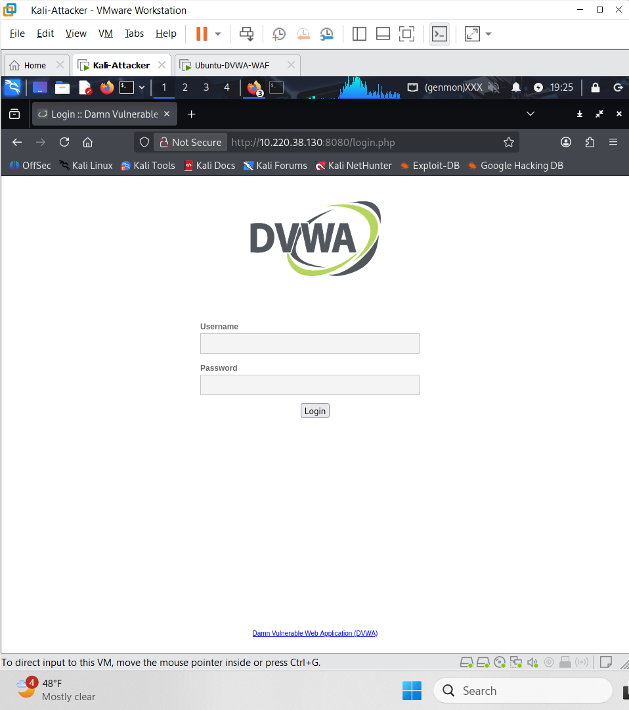
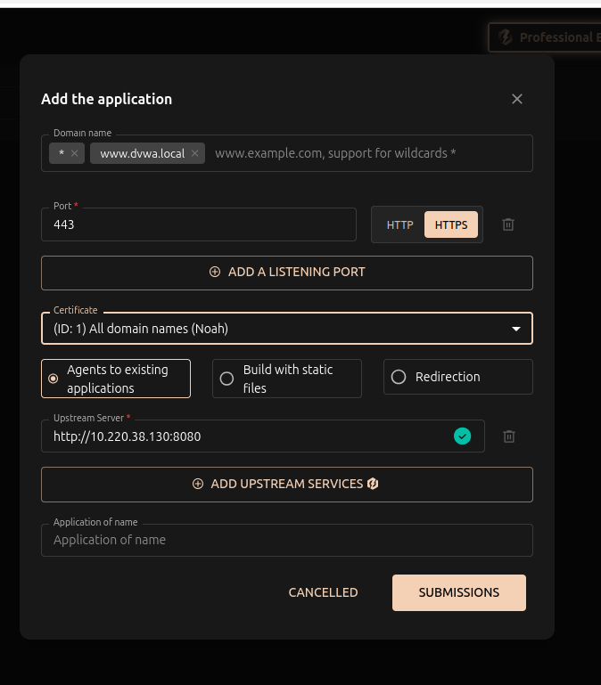
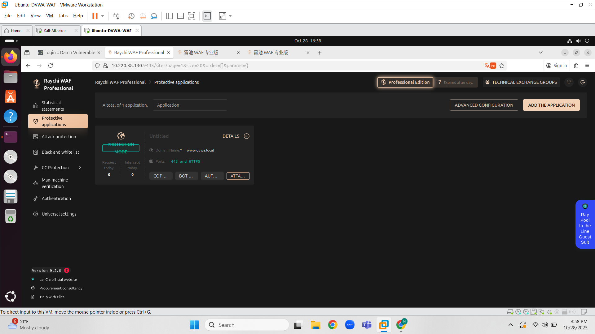
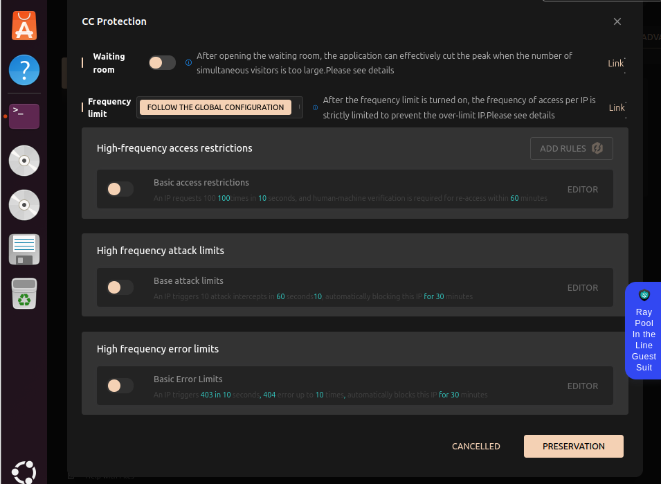
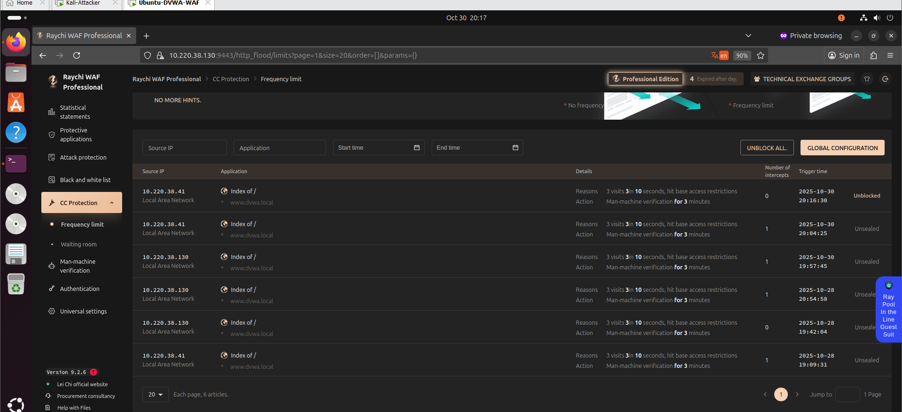
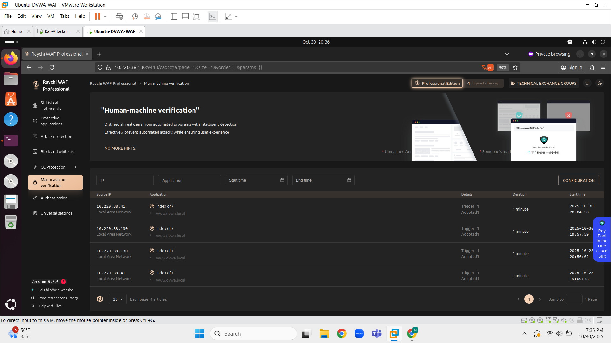

# DVWA + SafeLine WAF Lab

*Figure — VM network adapter set to Bridged so it receives its own IP on the network.*
## VM IP Addresses

*Figure — Kali attacker VM assigned IP `10.220.38.74` on the bridged network (verified with `ip addr`).*

*Figure — Ubuntu DVWA server assigned IP `10.220.33.146` on the bridged network (verified with `ip addr`).*

*Figure — Cloned DVWA into `/var/www/html`, set ownership and permissions, and copied `config.inc.php` to prepare DB credentials.*

*Figure — Created `dvwa` database and `dvwa_user` with granted privileges (sensitive passwords redacted).*
### Hosts mapping on attacker

*Figure — Added `10.220.38.150 dvwa.local` to `/etc/hosts` on the attacker so `http://dvwa.local` resolves to the Ubuntu DVWA server during testing.*
### SafeLine WAF install

*Figure — Running the SafeLine WAF installer script (`manager.sh`). Installer menu prompts to install/upgrade/uninstall; run as root to install the WAF.*

*Figure — Apache installed; `/etc/apache2` shows `sites-available`, `sites-enabled`, and `mods-enabled` (web server ready to host DVWA).*

*Figure — SafeLine WAF installed and accessible through the management dashboard. Ready to monitor and protect the DVWA web application.*

*Figure — DVWA login page loaded from the Kali attacker VM via `http://10.220.38.130:8080`. Confirms connectivity before running SQL injection tests.*

*Figure — Created a 4096-bit RSA private key and certificate signing request (CSR) using OpenSSL. Certificate used to enable HTTPS traffic through the SafeLine WAF.*

*Figure — Configured DVWA as a protected application in SafeLine WAF using HTTPS on port 443. Traffic is reverse-proxied to the backend server (`http://10.220.38.130:8080`) with the custom certificate added earlier.*

*Figure — SafeLine WAF showing DVWA (`www.dvwa.local`) actively protected over HTTPS on port 443. All inbound requests and intercepts will be logged and analyzed here.*

*Figure — TLS certificate for `www.dvwa.local` configured on SafeLine WAF. Uses a 4096-bit RSA key, issued by WIT, and valid for one year. Confirms encrypted HTTPS traffic between Kali and the DVWA server.*

### WAF Configuration & Security Testing

After deploying DVWA behind the SafeLine WAF, I enabled rate-limiting and bot-prevention rules to detect high-frequency attacks and automated traffic. These settings allowed the WAF to intercept requests and require verification when suspicious behavior was detected.

#### Rate-Limit Rule Configuration

*Enabled High-Frequency Access Restrictions. I configured the WAF to trigger human-machine verification if more than **5 requests** occur within **3 seconds** from a single IP.*

#### CC Protection Dashboard

*Overview of active CC protection controls for www.dvwa.local — including request frequency limits, attack restrictions, and error-based blocking.*

#### Frequency-Limit Blocks

*The WAF successfully intercepted traffic bursts to DVWA. Repeated fast visits triggered human-machine verification for **3 minutes**, proving the rule worked.*

#### Human-Machine Verification Logs

*Shows individual IP addresses being flagged and challenged, confirming that the application is protected against automated scanning or bot-style traffic.*

### Results & Takeaways
- DVWA was successfully deployed and reachable from an attacker machine over HTTP and HTTPS.
- SafeLine WAF was installed as a reverse proxy, encrypted with a 4096-bit RSA TLS certificate.
- Automated rate-limit and high-frequency access rules blocked rapid requests from the attacker.
- Human-machine verification was triggered, proving that the WAF actively protected the application.
